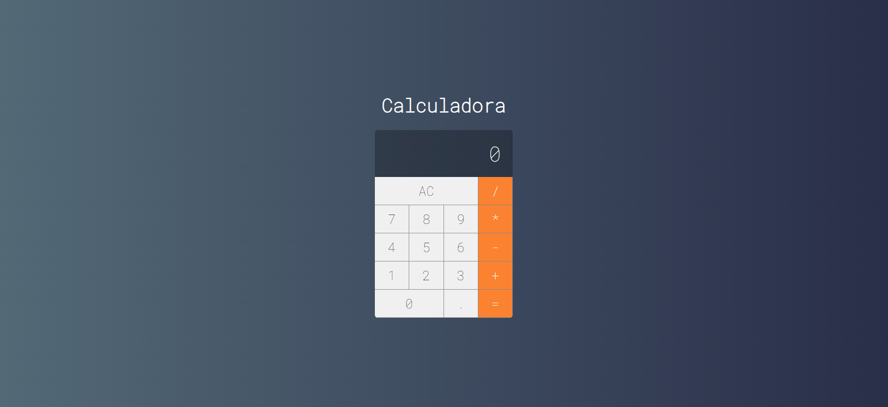

<h1 align="center"> Calculadora </h1>

CALCULADORA 

  <a href="#-tecnologias">Tecnologias</a>&nbsp;&nbsp;&nbsp;|&nbsp;&nbsp;&nbsp;
  <a href="#-projeto">Projeto</a>&nbsp;&nbsp;&nbsp;|&nbsp;&nbsp;&nbsp;
  <a href="#memo-recursos">Recurso</a>&nbsp;&nbsp;&nbsp;|&nbsp;&nbsp;&nbsp;
  <a href="#contribuição">Contribuição</a>&nbsp;&nbsp;&nbsp;|&nbsp;&nbsp;&nbsp;
  <a href="#memo-licença">Licença</a>

  

 

  

## 🚀 Tecnologias

Esse projeto foi desenvolvido com as seguintes tecnologias:

- HTML e CSS
- JavaScript
- React
- Git e Github

## 💻 Projeto

Esta é uma simples calculadora desenvolvida em React. O projeto serve como um exemplo de aplicação React que realiza operações matemáticas básicas.

- [Acesse o projeto finalizado, online](https://github.com/GabrielSantos777/calculadora)

## :memo: Recursos

- Adição.
- Subtração.
- Multiplicação. 
- Divisão.
- Limpeza fácil dos campos.

## Contribuição

Contribuições são bem-vindas! Sinta-se à vontade para criar problemas (issues) ou enviar solicitações de pull (pull requests) para melhorias ou correções.

## :memo: Licença

Esse projeto está sob a licença MIT.

---

*Este projeto foi desenvolvido por [Gabriel Santos](https://github.com/GabrielSantos777).*